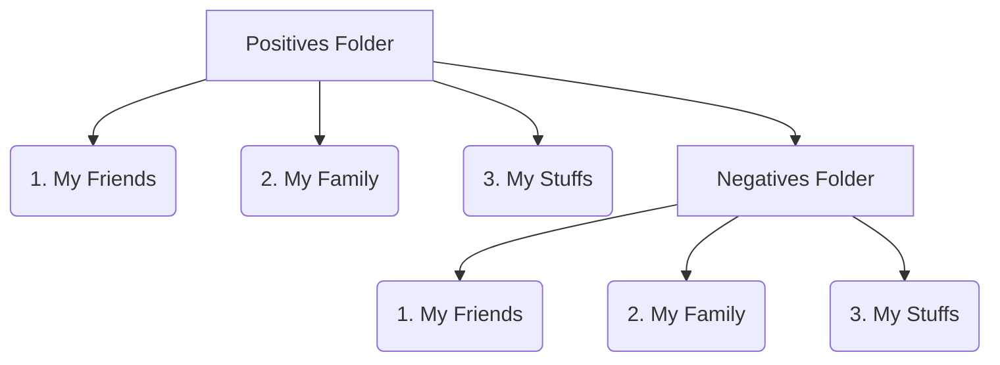

# KrawArranger
Kjmaro Negatives Arranger. The purpose of this program is to have and maintain a mirror of the folder
structure of your pictures/media with all their corresponding negatives (raw).

## Folders organization
KrawArranger needs to know what is the PATH of three folders:
- **Positives folder**: Here is where all your multimedia content is allocated, positives (JPG, PNG, etc.) and negatives (NEF, CR2, etc.)
- **Negatives folder**: Here is where you want to store your negatives.
- **Results folder**: Here is where the program will store the logs and results of the execution.
> Note: A filter can be included to KrawRranger to only analyse the desired folders inside the positive folder

## Logic of KrawArranger
- **1.** Scans the folders-tree stored in Negatives folder and raises an error if (at least) the same tree is not in the Positives folder. The purpose of this step is to avoid loosing the traceability of the negatives folder (if the folder name has changed and you don't know where is its negative corresponding folder)
- **2.** Looks for all the negative files in the Positive folder. 
- **3.** Once found the negatives it will attempt to move them to the negatives folder creating the same folder-tree to reach them in the Positives folder (if it doesn't exist).
- **4.** If the files to move to negatives doesn't exist will be moved, otherwise an error will be raised indicating that the files already exist in Negatives.
- **5.** All the folder creation and file movement is logged for user review.
	
## Multimedia Organization Example

## Future features
- Include in the log after one file movement a verification step (with MD5) to ensure that the file was mover properly and it doesn't exists in origin.